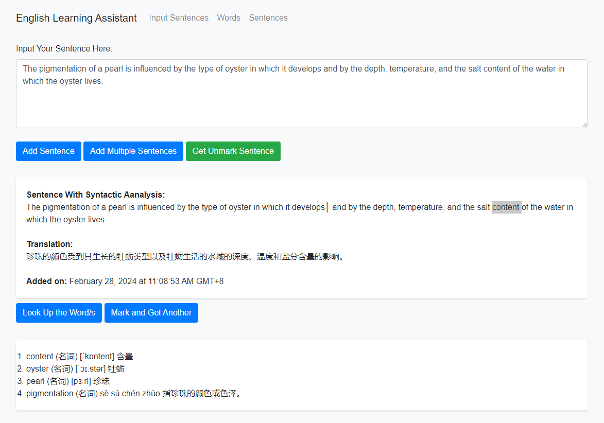
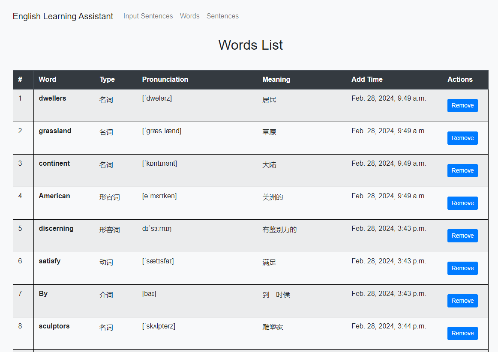
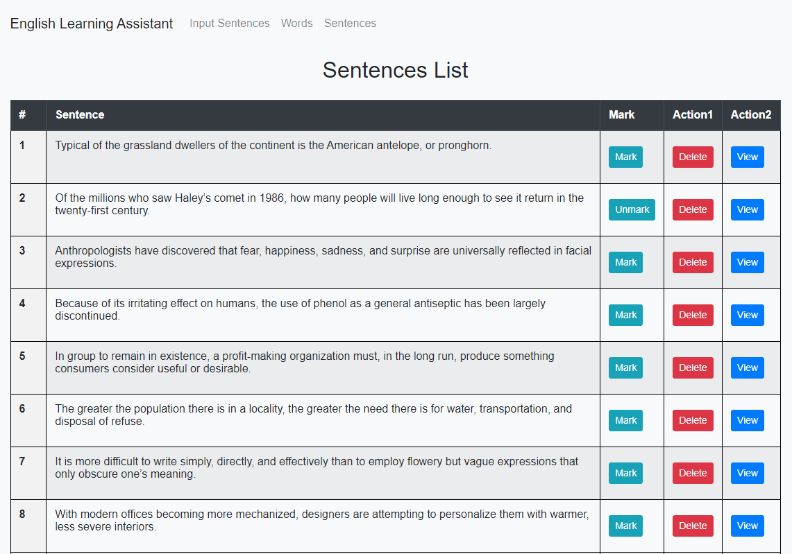
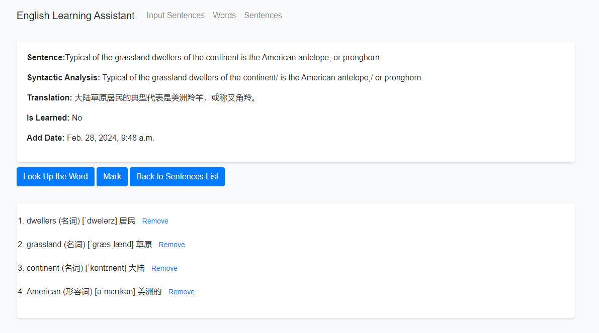

# AI英语学习助手-帮助建立词库和句子（基于Django和 OpenAI GPT API）

学了很久的英语，但是发现还是被单词困住了，天天查句子查单词太麻烦，现在有了Chat GPT，能够很好得帮助学习英语，在github上面找了一些开源的，但是觉得做的不太好，因此自己开发一个。

## 理念

通过背单词的方式来学英语说实在的还是低效，不如通过句子来学单词，找来句子比直接看单词能更有效得学习英语。利用句子学习英语的前提是能够看懂句子才行，我们自己可能会看不懂句子，但是目前的自然语言模型都可以。所以：

0. 使用Django开发，使用方法极简，开发也非常简单。所有数据都在本地，也可使用云服务器进行云端访问。

1. 使用AI帮忙翻译和断句，减轻句子的理解困难；
2. 使用AI进行查词，查询这个词在当前句子中的词性和意思，帮助准确理解单词，不再局限于单词的某一个含义;
3. 遇到不会的词或词组，选中，点击查词，不再需要专门的词典，AI帮助完成，而且针对句子，单词理解更正确；
4. 自行添加句子，添加后即可获得翻译并进行学习；
5. 随机获得句子，不再按顺序学习，总有新鲜感；
6. 批量添加句子，按行添加；
7. 标记句子已会，不用再学习；
8. 我目前已经添加100多个句子，可以直接开始使用和学习。


## 系统界面展示
输入句子和学习页面：

单词列表页面：

句子列表页面：

句子详情页面：


## 使用方法

### 安装必要的包
```
pip install Django
pip install openai>=1.12
# 其余缺少的包请自行安装，应该是没有了
```

### 运行系统
1. 配置环境变量：
```
Ubuntu terminal：
export OPENAI_API_KEY='your-key'
export OPENAI_API_BASE="https://api.openai.com/v1"

Windows powershell：
$env:OPENAI_API_KEY='your-key'
$env:OPENAI_API_BASE="https://api.openai.com/v1"
```
2. 启动服务：

```
#进入到mysite目录下
...path_to_AI_English_learning_Assiatant/> cd mysite/
#启动服务
...path_to_AI_English_learning_Assiatant/mysite> python manage.py runserver 0.0.0.0:8000 --insecure
```
3. 浏览器访问下面网页即可开始使用：  
http://执行上述命令的机器的ip地址:8000/polls/  
例如：  
执行上面命令的机器的IP地址为192.168.1.101 那么使用下面的地址进行访问:  
http://192.168.1.101:8000/polls/  
使用本地访问：  
http://127.0.0.1:8000/polls/  
注：系统可以部署在云服务器上面，这样可以通过互联网进行访问。

3. 如果想进行数据库管理，访问：  
http://127.0.0.1:8000/admin/  
账户：admin  
密码：admin123  
也可以使用 python manage.py createsuperuser 进行创建

## 联系作者
Email: 227229218@qq.com  
如果帮到了你，感谢您的赞助（❥(^_-)：  
If this is helpful to you, Buy me a coffe（❥(^_-):  


## 版权声明
本系统服从GNU GPL开源协议。
